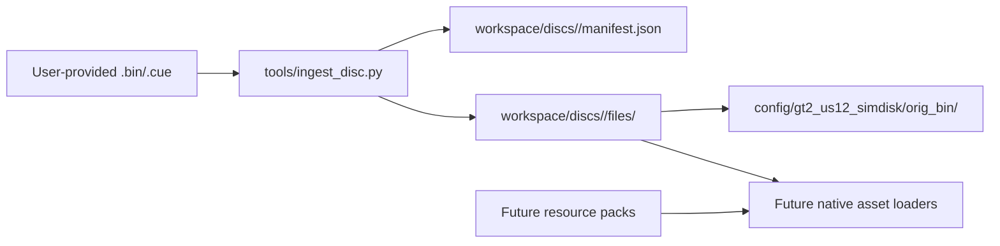

# Architecture

## Two-layer direction

GT2-DECOMP deliberately separates two concerns:

1. **Faithful game core**
   - matching decompilation of the original PS1 executable and overlays;
   - behavior parity with Simulation Mode NTSC-U 1.2;
   - validation against the original binary and original game behavior.

2. **Future native host/runtime**
   - platform, input, audio, storage, rendering, and packaging layers for Windows and Android;
   - runtime-selectable profiles;
   - modern conveniences without rewriting unknown game logic by guesswork.

The project should not trade away correctness in the game core just to accelerate the native host.

## Disc/data flow

`workspace/` is intentionally ignored by Git. It is the boundary between copyrighted user-owned input and project source.

## Disc variants

- `vanilla`: exact known US 1.2 Simulation Mode image.
- `compatible_modified`: same structural target, but with a non-vanilla overall hash. This is the compatibility path for user-patched discs such as Project A-Spec.

The current ingest tool verifies the PS1 disc layout, boot executable, expected top-level files, and known vanilla hash when available.

## Runtime profiles

The future native runtime exposes at least two public profiles:

- `enhanced` — default user-facing mode with native equivalents of commonly used quality-of-life patches;
- `original` — conservative mode for preservation, comparison, and regression testing.

The public option contract lives in `runtime/config/profiles.json`.

## Localization direction

The first localization path is **resource import**, not PAL executable parity:

- base game remains NTSC-U 1.2;
- future PAL text/assets are packaged as resource packs;
- the loader applies those resources over the user-provided base content.

The initial pack manifest contract lives in `resource_packs/schema.json`.
