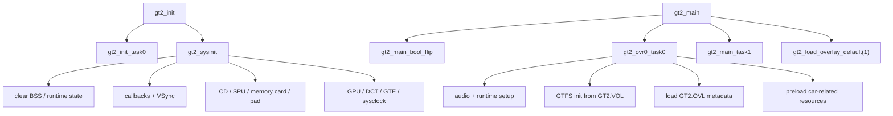
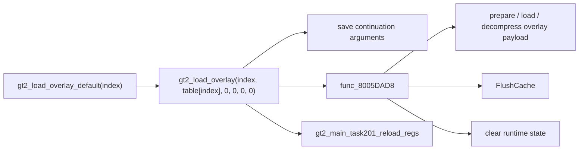
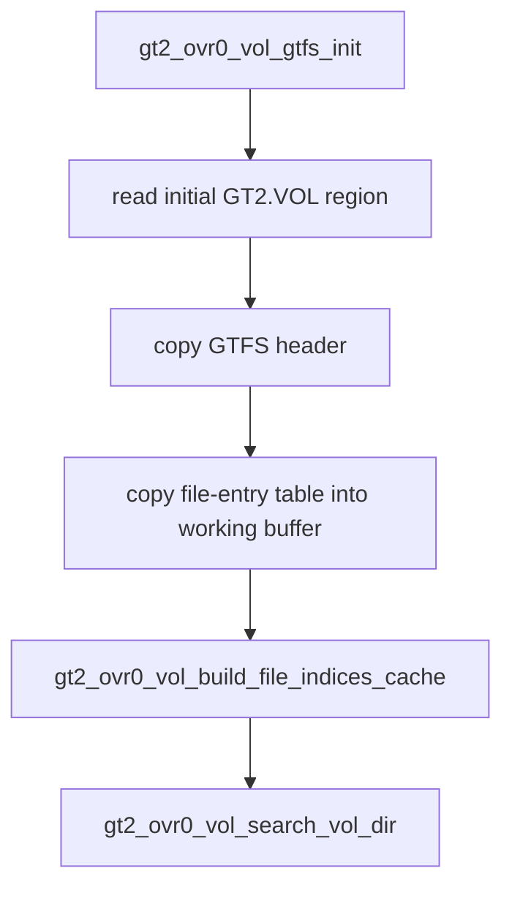

# Boot and loader map

This document captures the first dependency pass after the Phase 0 baseline was made fully matching.

## Startup path recovered so far



## What the code already tells us

### `gt2_init`

`gt2_init` is intentionally small:

1. `gt2_init_task0()`
2. `gt2_sysinit()`

`gt2_sysinit()` is the real hardware/runtime initializer. The recovered call order is:

1. clear runtime memory via `gt2_sysinit_task0()`;
2. reset callbacks and establish the initial VSync wait;
3. initialize CD, SPU, memory card, and pad input;
4. initialize GPU, DCT, GTE, and the system clock.

### `gt2_main`

`gt2_main()` is also short, but it is the useful handoff point for the whole game:

1. `gt2_main_bool_flip()`
2. `gt2_ovr0_task0()`
3. `gt2_main_task1()`
4. `gt2_load_overlay_default(1)`

That strongly suggests overlay 0 is the bootstrap environment and overlay 1 is the first major post-bootstrap executable state.

### `gt2_ovr0_task0`

`gt2_ovr0_task0()` is the bootstrap workhorse. Its current recovered sequence covers:

- DMA / VSync preparation;
- audio initialization;
- pad and SDK event setup;
- BIOS font setup;
- initial music setup;
- `GT2.VOL` initialization;
- `GT2.OVL` metadata loading;
- a batch of early resource loaders, including car assets.

This function is the best current place to understand what must be ready before the first real user-facing state can run.

## Overlay loading model

The loader path currently looks like this:



`gt2_main_saveregisters()` and `gt2_main_task201_reload_regs()` show that overlay switches are not a simple function call. The game preserves a continuation context, loads/decompresses a different executable payload, then restores registers and resumes through the new state.

That continuation model is important for any future native runtime: the faithful core should first preserve the original control-flow semantics before the host layer abstracts them.

## GT2.OVL metadata path

The `GT2.OVL` bootstrap path is already visible:

```mermaid
flowchart TD
    A["gt2_ovr0_task0a_ovr_entrypoint"] --> B["gt2_ovr0_task0a_ovr_func0"]
    B --> C["gt2_main_task0a_ovr_func1(\"gt2.ovl\")"]
    C --> D["gt2_main_task082_file_loader"]
    B --> E["parse GT2.OVL header fields"]
    B --> F["store overlay payload metadata in D_801EF610"]
```

`gt2_ovr0_task0a_ovr_func0` is now decompiled. It:

- loads `gt2.ovl`;
- reads two unaligned fields from its bootstrap header;
- derives the overlay load base relative to `D_801C93E8`;
- records the payload size;
- optionally allocates a scratch buffer;
- copies the payload or a small header block into the destination state used by later overlay transitions.

The scratch allocation path is now concrete end to end:

- `gt2_main_task0a_ovr_func2` is a 16-byte-aligned best-fit allocator over a doubly linked heap list rooted at `D_800A8D50`;
- `gt2_main_task0a_ovr_func20` performs the split only when the remainder can still hold another 16-byte header plus at least 16 bytes of payload.
- `gt2_sdk_builtin_vec_delete_func00` coalesces a block with its successor by relinking the list and folding the successor's header plus payload back into the current block.

Together they now expose the allocator's full local vocabulary: find, split, and merge 16-byte-header heap blocks without hiding that behavior behind raw assembly.

## GT2.VOL path

The early `GT2.VOL` path is much clearer already:



The existing recovered code establishes three useful concepts:

- `gt2_vol_header_ptr`: retained GTFS header data;
- `gt2_vol_buffer`: working storage for the file-entry table;
- `gt2_vol_cached_dir_indices`: fast lookup cache for frequently used directories.

That means `GT2.VOL` understanding is already far enough along to support the next serious reverse-engineering step: tracing which cached indices correspond to boot assets, car data, menus, and later race content.

## Recommended next work

1. Recover names and structure for the overlay table used by `gt2_load_overlay_default`.
2. Build a concrete inventory of `gt2_vol_cached_dir_indices` consumers so GT Mode assets can be followed from symbolic directory index to actual loader behavior.
3. Continue naming the fields in the `GT2.OVL` bootstrap state now that both the metadata loader and its heap allocation path are expressed in C.

Once those three are in place, moving into save/load and the first GT Mode menu state will be much less blind.
